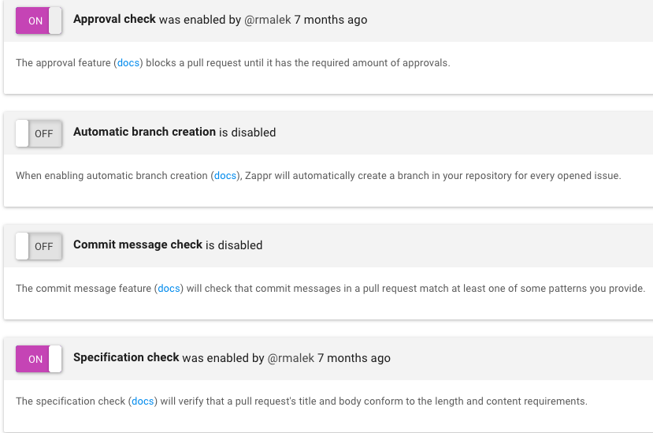

# Troubleshooting Zappr

This page tries to explain common sources of error and give instructions how to fix them.

Terminology:

* Zapprfile: A file named `.zappr.yaml` located in the root directory of your repository.

## I can't enable or disable checks for my repository

You don't have admin access for this repository. Either become an admin yourself or ask one to toggle this check.
 
## I updated my Zapprfile in a PR, but it's not picked up.

Zappr reads your Zapprfile from the repository's default branch (it's `master` by default). Changes on a feature branch are ignored.

## I enabled Zappr, but approvals don't seem to count

If you have the option `approvals.from` configured, which can look like this in your Zapprfile:
 
~~~ yaml
approvals:
  from:
    orgs:
      - zalando
~~~

And Zappr's status looks like this:

Then you need to make sure that

* This organization exists in the GitHub instance (github.com or your GHE)
* Everybody who is supposed to approve is a **public** member of this organization

You can change and verify the membership visibility at `<GITHUB INSTANCE>/orgs/<YOUR ORG>/people` (e.g. [github.com/orgs/zalando/people](https://github.com/orgs/zalando/people)).

## I enabled Zappr, but it hangs with status "pending"

Until now there were two reasons why this happened:

### The 99% case

The person who enabled the Zappr check does not have access to the repository anymore, or his OAuth GitHub token gets expired. Since Zappr stores a personal access token for every check (to communicate with GitHub during check execution), a check will stop working if its token cannot be used to communicate with GitHub anymore.
 
  **Workaround**: 
  - Use REFRESH OAUTH TOKEN button to refresh the stored token or disable/enable the check.
  - Close and re-open the pull request.

### API errors

Services Zappr depends on return http status code > 499.

**Workaround**: Login to Zappr; Let the repository sync finish; Select the repository; on the right side disable and enable the Zappr check to retry the services call.
¬

### The case that happened only once

There is a limit of 1000 status updates per combination of context (like `zappr`, `zappr/pr/specification`...) and commit ID. If there are A LOT of comments in a PR, this limit might be exceeded.

**Workaround**: Add an additional commit to the PR.
